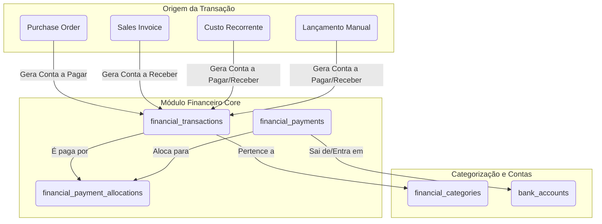

# Proposta de Arquitetura para o Módulo Financeiro do Impex

**Autor:** Manus AI  
**Data:** 24 de Novembro de 2025

## 1. Introdução

Este documento detalha uma arquitetura robusta e escalável para o módulo financeiro do sistema Impex. O objetivo é fornecer controle total sobre as finanças, incluindo contas a pagar e a receber, fluxo de caixa, custos recorrentes e relatórios gerenciais, aproveitando a estrutura existente e preenchendo as lacunas funcionais.

## 2. Análise da Estrutura Atual

Após uma análise detalhada das migrations e modelos existentes, identificamos uma base sólida, mas com algumas oportunidades de melhoria para atender aos requisitos de um controle financeiro completo.

### 2.1. Pontos Fortes (O que vamos aproveitar)

- **`Purchase Orders` (PO) e `Sales Invoices` (SI):** Já existem e servem como os documentos primários que **originam** as obrigações financeiras.
- **`Supplier Payments` e `Customer Receipts`:** Estruturas básicas para registrar as entradas e saídas de caixa já estão presentes.
- **`Payment Allocations`:** O conceito de alocar um pagamento a múltiplos documentos já existe, embora precise de um pequeno ajuste.

### 2.2. Gaps e Oportunidades (O que vamos construir)

1.  **Falta de um Lançamento Financeiro Centralizado:** Atualmente, as obrigações financeiras estão implícitas nos Pedidos de Compra e Faturas de Venda. Precisamos de uma tabela central (`financial_transactions`) para representar cada conta a pagar e a receber de forma explícita.
2.  **Alocação Incorreta:** Os pagamentos (`SupplierPaymentAllocation`) estão sendo alocados a `Purchase Orders`. O correto é alocar pagamentos a **Contas a Pagar** (que são originadas de POs ou de faturas de fornecedores).
3.  **Ausência de Custos Recorrentes/Manuais:** Não há como registrar despesas que não vêm de uma PO (ex: aluguel, salários, impostos).
4.  **Visão de Fluxo de Caixa Unificada:** Com tabelas separadas, é difícil gerar um relatório de fluxo de caixa consolidado.

## 3. Arquitetura Proposta (Revisada para Múltiplas Moedas)

Você levantou um ponto essencial: a necessidade de lidar com transações e pagamentos em moedas diferentes. A arquitetura foi ajustada para incorporar essa complexidade, incluindo o cálculo automático de ganhos e perdas cambiais.

A nova arquitetura se baseia em um conceito central: a tabela `financial_transactions`. Ela será o coração do módulo financeiro, registrando **toda e qualquer obrigação financeira**, seja ela uma conta a pagar ou a receber.

### 3.1. Diagrama da Nova Arquitetura

### 3.2. Novas Tabelas e Modelos

#### 3.2.1. `financial_transactions` (Lançamentos Financeiros)

Esta será a tabela principal. Cada registro é uma conta a pagar ou a receber, **com sua própria moeda**.

| Coluna | Tipo | Descrição |
| :--- | :--- | :--- |
| `id` | `bigIncrements` | Chave Primária |
| `description` | `string` | Descrição do lançamento (ex: "Fatura de Venda #SI-001") |
| `type` | `enum('payable', 'receivable')` | Tipo de lançamento: a pagar ou a receber |
| `status` | `enum('pending', 'partially_paid', 'paid', 'overdue')` | Status do lançamento |
| `amount` | `bigInteger` | Valor total da obrigação (em centavos) |
| `paid_amount` | `bigInteger` | Valor já pago (em centavos) |
| `due_date` | `date` | Data de vencimento |
| `transaction_date` | `date` | Data de competência do lançamento |
| `financial_category_id` | `foreignId` | Categoria (ex: Custo Fixo, Receita de Vendas) |
| `transactable_id` | `morphs` | ID do modelo de origem (ex: `PurchaseOrder`, `SalesInvoice`) |
| `transactable_type` | `morphs` | Nome do modelo de origem |
| `currency_id` | `foreignId` | Moeda da transação (ex: EUR) |
| `exchange_rate_to_base` | `decimal` | Taxa de câmbio para a moeda base no dia da transação |
| `amount_base_currency` | `bigInteger` | Valor na moeda base da empresa (para relatórios) |
| `...timestamps` | | |

#### 3.2.2. `financial_payments` (Pagamentos e Recebimentos)

Esta tabela registrará cada transação monetária real (entrada ou saída de dinheiro), **com sua própria moeda**.

| Coluna | Tipo | Descrição |
| :--- | :--- | :--- |
| `id` | `bigIncrements` | Chave Primária |
| `description` | `string` | Descrição do pagamento (ex: "Pagamento Fornecedor X") |
| `type` | `enum('debit', 'credit')` | `debit` = Saída (pagamento), `credit` = Entrada (recebimento) |
| `bank_account_id` | `foreignId` | Conta bancária de onde o dinheiro saiu/entrou |
| `payment_date` | `date` | Data em que o pagamento foi efetuado |
| `amount` | `bigInteger` | Valor total do pagamento (em centavos) |
| `reference` | `string` | ID da transação, número do cheque, etc. |
| `currency_id` | `foreignId` | Moeda do pagamento (ex: USD) |
| `exchange_rate_to_base` | `decimal` | Taxa de câmbio para a moeda base no dia do pagamento |
| `amount_base_currency` | `bigInteger` | Valor do pagamento na moeda base da empresa |
| `...timestamps` | | |

#### 3.2.3. `financial_payment_allocations` (Alocações de Pagamentos)

Esta tabela pivot fará a mágica de conectar múltiplos pagamentos a múltiplos lançamentos.

| Coluna | Tipo | Descrição |
| :--- | :--- | :--- |
| `id` | `bigIncrements` | Chave Primária |
| `financial_payment_id` | `foreignId` | O pagamento/recebimento realizado |
| `financial_transaction_id` | `foreignId` | A conta a pagar/receber que está sendo quitada |
| `allocated_amount` | `bigInteger` | Valor alocado, **na moeda da transação (`financial_transaction`)** |
| `gain_loss_on_exchange` | `bigInteger` | Ganho ou Perda Cambial gerado nesta alocação (em centavos da moeda base) |

#### 3.2.4. `financial_categories` (Categorias Financeiras)

Para classificar todos os lançamentos e gerar relatórios DRE.

| Coluna | Tipo | Descrição |
| :--- | :--- | :--- |
| `id` | `bigIncrements` | Chave Primária |
| `name` | `string` | Nome da categoria (ex: "Custos Fixos", "Receita de Vendas") |
| `type` | `enum('expense', 'revenue')` | Tipo de categoria |
| `parent_id` | `foreignId` | Para criar sub-categorias (ex: Custos Fixos > Aluguel) |

#### 3.2.5. `recurring_transactions` (Lançamentos Recorrentes)

Para automatizar a criação de custos fixos e receitas previsíveis.

| Coluna | Tipo | Descrição |
| :--- | :--- | :--- |
| `id` | `bigIncrements` | Chave Primária |
| `description` | `string` | Descrição (ex: "Mensalidade Aluguel") |
| `financial_category_id` | `foreignId` | Categoria do custo/receita |
| `amount` | `bigInteger` | Valor da recorrência |
| `frequency` | `enum('daily', 'weekly', 'monthly', 'yearly')` | Frequência |
| `start_date` | `date` | Data de início da recorrência |
| `end_date` | `date` | Data de término (opcional) |
| `next_due_date` | `date` | Próxima data de geração do lançamento |

### 3.3. Lógica de Funcionamento

1.  **Criação de Lançamentos:**
    - Ao **aprovar** uma `Purchase Order`, um *Observer* criará um `financial_transaction` do tipo `payable`.
    - Ao **enviar** uma `Sales Invoice`, um *Observer* criará um `financial_transaction` do tipo `receivable`.
    - Um *Scheduled Command* (`php artisan finance:generate-recurring`) rodará diariamente, verificando a tabela `recurring_transactions` e criando os `financial_transactions` necessários.

2.  **Registro de Pagamentos/Recebimentos:**
    - O usuário irá a uma nova tela "Registrar Pagamento" ou "Registrar Recebimento".
    - Ele informará o valor, a data, a conta bancária e selecionará **uma ou mais contas a pagar/receber** da tabela `financial_transactions`.

3.  **Alocação (M-para-N):**
    - Ao salvar o pagamento, o sistema criará um registro em `financial_payments`.
    - Para cada conta selecionada, criará um registro em `financial_payment_allocations`, ligando o pagamento à conta.
    - O sistema atualizará o campo `paid_amount` e o `status` na tabela `financial_transactions`.

### 3.4. Lógica de Variação Cambial

A principal mudança é como lidamos com a variação cambial entre a data da obrigação e a data do pagamento.

**Cenário:**
- Sua moeda base é **BRL**.
- Você aprova uma PO de **€1.000**. No dia, a taxa é **€1 = R$5,50**.
- O sistema cria uma `financial_transaction` de **€1.000** (ou **R$5.500** na moeda base).

**30 dias depois, você paga essa PO da sua conta em USD.**
- No dia do pagamento, a taxa é **€1 = R$5,80**.
- Você precisa de **€1.000** para quitar a dívida. Isso agora custa **R$5.800**.

**Lógica do Sistema:**

1.  **Criação do Pagamento:** Você registra um pagamento (ex: em USD) que será usado para quitar a dívida em EUR.
2.  **Alocação:** Ao alocar o pagamento à transação de €1.000, o sistema calcula:
    - **Valor da Dívida na Data da Transação (em BRL):** R$5.500
    - **Valor da Dívida na Data do Pagamento (em BRL):** R$5.800
    - **Variação Cambial:** R$5.800 - R$5.500 = **R$300 (Perda)**
3.  **Registro Contábil:**
    - A `financial_payment_allocation` registra a quitação de €1.000.
    - O campo `gain_loss_on_exchange` registra **-30000** (centavos).
    - Isso permite gerar um relatório de **Resultado com Variação Cambial**, essencial para a contabilidade.

## 4. O que Descartar e Adaptar

- **`purchase_invoices`:** Como solicitado, esta tabela será **descartada**. A obrigação de pagamento será gerada diretamente pela `Purchase Order`. Se for necessário anexar a fatura do fornecedor, podemos usar um sistema de anexos polimórficos na `Purchase Order` ou no `financial_transaction`.
- **`supplier_payments`, `customer_receipts` e suas alocações:** Estas tabelas serão **substituídas** pelas novas tabelas `financial_payments` e `financial_payment_allocations`. Podemos criar uma migration para migrar os dados antigos para a nova estrutura.

## 5. Próximos Passos

1.  **Validação:** Aguardar sua aprovação sobre esta arquitetura.
2.  **Migrations:** Criar as migrations para as novas tabelas.
3.  **Models e Relações:** Desenvolver os Models do Eloquent com os devidos relacionamentos.
4.  **Observers e Lógica:** Implementar os Observers para automatizar a criação de transações.
5.  **Filament Resources:** Criar as telas no Filament para gerenciar Lançamentos, Pagamentos, Categorias e Recorrências.

Esta arquitetura centralizada não só resolve todos os requisitos solicitados, mas também cria uma base sólida para futuras funcionalidades, como relatórios de DRE (Demonstrativo de Resultado do Exercício), fluxo de caixa projetado e análises de rentabilidade. 
