# Shipments System - Architecture Diagrams

**Visual reference for the refactored Shipments system**

---

## 📊 Entity Relationship Diagram (ERD)

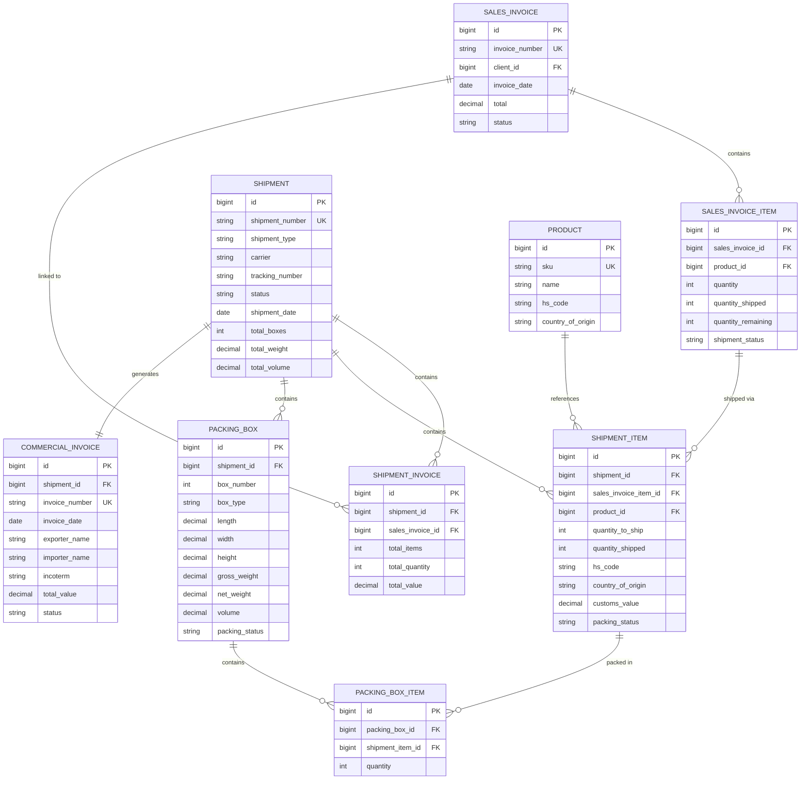

---

## 🔄 Shipment Creation Workflow

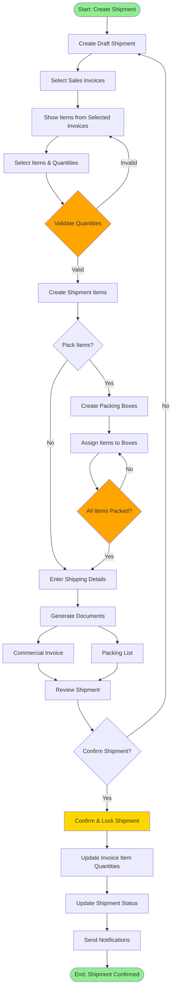

---

## 📦 Packing Process Flow

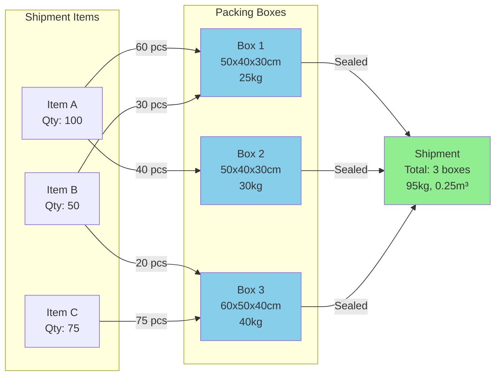

---

## 🔢 Quantity Tracking Logic

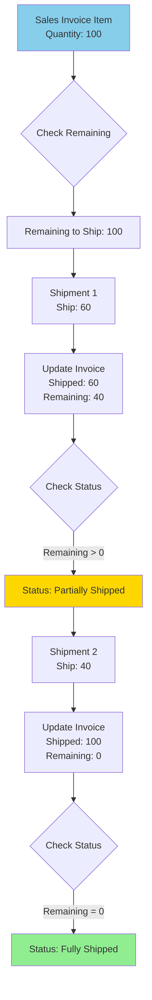

---

## 🌍 Multi-Invoice Shipment Example

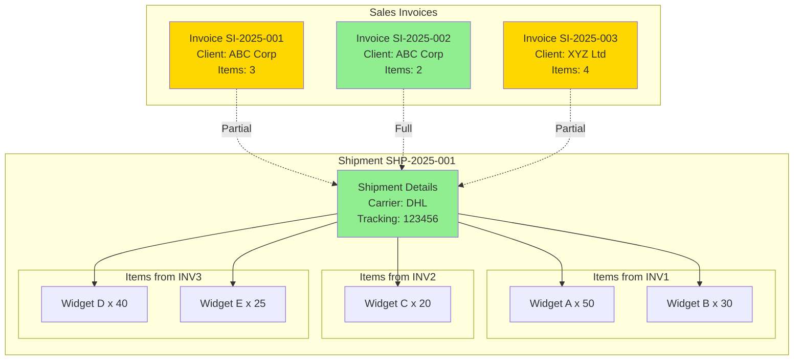

---

## 📄 Document Generation Flow

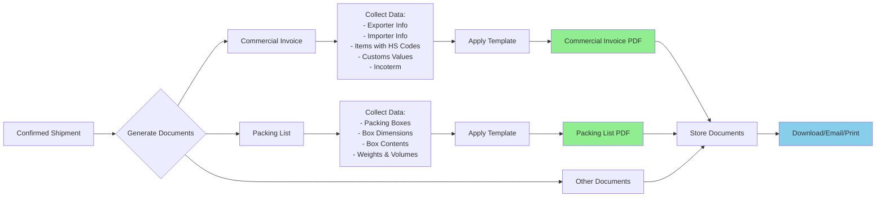

---

## 🎯 Shipment Status Lifecycle

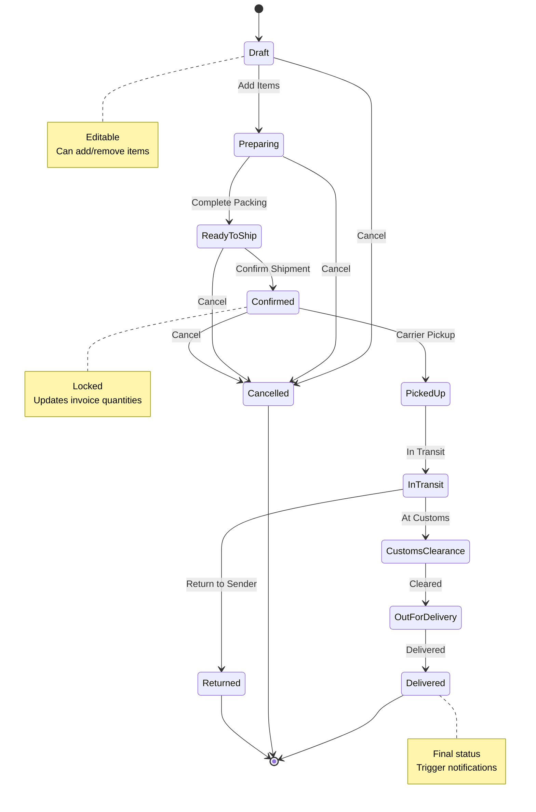

---

## 🏗️ System Architecture Layers

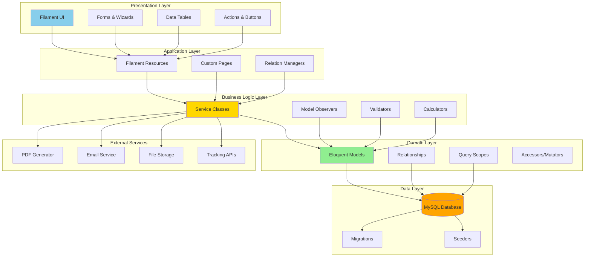

---

## 📊 Data Flow: Creating a Shipment

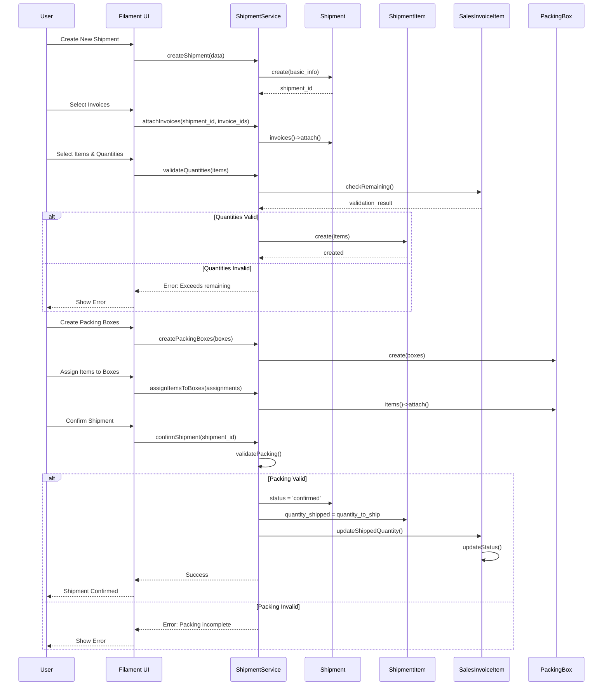

---

## 🎨 UI Component Hierarchy

```mermaid
graph TD
    ShipmentResource[ShipmentResource]
    
    ShipmentResource --> ListShipments[ListShipments Page]
    ShipmentResource --> CreateShipment[CreateShipment Page]
    ShipmentResource --> EditShipment[EditShipment Page]
    ShipmentResource --> ViewShipment[ViewShipment Page]
    
    CreateShipment --> Wizard[Wizard Form]
    Wizard --> Step1[Step 1: Basic Info]
    Wizard --> Step2[Step 2: Select Invoices]
    Wizard --> Step3[Step 3: Select Items]
    Wizard --> Step4[Step 4: Packing]
    Wizard --> Step5[Step 5: Shipping Details]
    Wizard --> Step6[Step 6: Review]
    
    ViewShipment --> TabOverview[Tab: Overview]
    ViewShipment --> TabInvoices[Tab: Invoices]
    ViewShipment --> TabItems[Tab: Items]
    ViewShipment --> TabPacking[Tab: Packing]
    ViewShipment --> TabDocuments[Tab: Documents]
    ViewShipment --> TabTracking[Tab: Tracking]
    
    TabInvoices --> InvoicesRM[InvoicesRelationManager]
    TabItems --> ItemsRM[ItemsRelationManager]
    TabPacking --> PackingRM[PackingBoxesRelationManager]
    
    TabDocuments --> GenCI[Generate Commercial Invoice]
    TabDocuments --> GenPL[Generate Packing List]
    
    ViewShipment --> Actions[Header Actions]
    Actions --> ConfirmAction[Confirm Shipment]
    Actions --> CancelAction[Cancel Shipment]
    Actions --> TrackAction[Add Tracking Event]
    
    style ShipmentResource fill:#87CEEB
    style Wizard fill:#FFD700
    style ViewShipment fill:#90EE90
```

---

## 🔐 Permission Structure

```mermaid
graph TB
    SuperAdmin[Super Admin]
    Manager[Manager]
    Warehouse[Warehouse Staff]
    Viewer[Viewer]
    
    SuperAdmin --> AllPerms[All Permissions]
    
    Manager --> ViewShipments[View Shipments]
    Manager --> CreateShipments[Create Shipments]
    Manager --> EditShipments[Edit Shipments]
    Manager --> ConfirmShipments[Confirm Shipments]
    Manager --> GenerateDocs[Generate Documents]
    Manager --> DeleteShipments[Delete Shipments]
    
    Warehouse --> ViewShipments
    Warehouse --> CreateShipments
    Warehouse --> EditShipments
    Warehouse --> PackItems[Pack Items]
    Warehouse --> UpdateTracking[Update Tracking]
    
    Viewer --> ViewShipments
    Viewer --> ViewDocs[View Documents]
    
    style SuperAdmin fill:#FF6347
    style Manager fill:#FFD700
    style Warehouse fill:#87CEEB
    style Viewer fill:#90EE90
```

---

These diagrams provide a visual reference for understanding the refactored Shipments system architecture, workflows, and data relationships.
